# AWS-Three-Tier-App-Terraform
3 Tier App Deploy to AWS using Terraform

### Architectural Diagram


## Step 1

### Set UP


-	Download Code from Github or using the below URLon your local

```
git clone https://github.com/aws-samples/aws-three-tier-web-architecture-workshop.git
```

- S3 bucket creation using terraform
 
Before creating the s3 bucket using terraform we need to set up the terraform lab. I have written a blog to set up terraform lab. To see that click the link below;
https://medium.com/@fawazcp/create-ec2-instance-using-terraform-71776acf16e3

Once the lab is ready then create a new folder for this project and create new file called s3_bucket.tf then add the below resource. (make sure the s3 bucket name should be unique)

```
provider "aws" {
  region = "us-east-1"
}

resource "aws_s3_bucket" "my_bucket" {
  bucket = "terrafrom-3tier-project-bucket"
}
```

Open any terminal and execute the below terraform commands

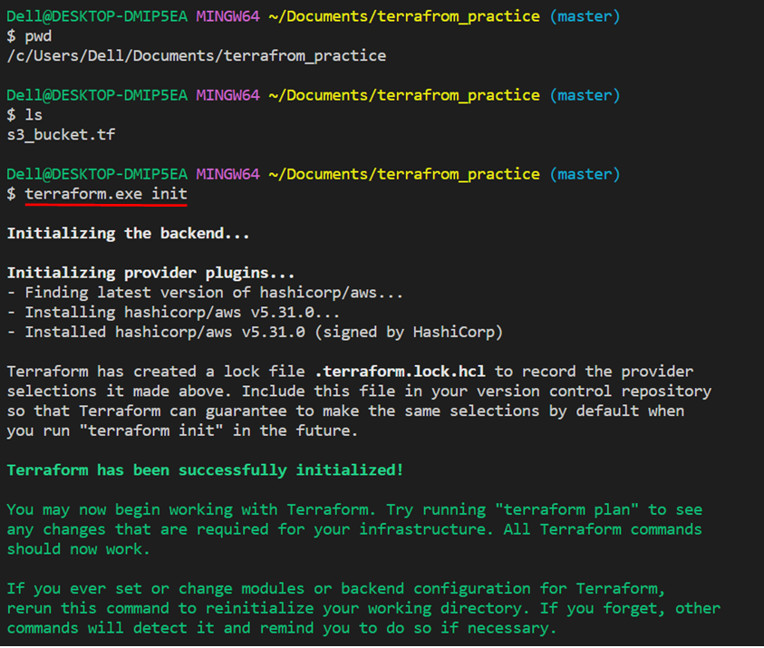

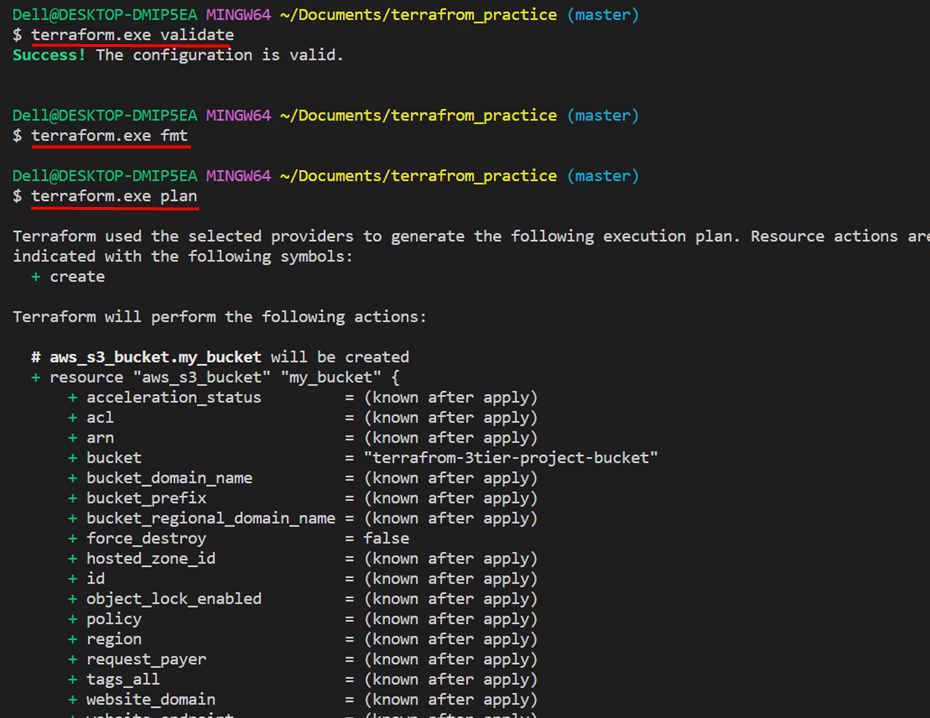

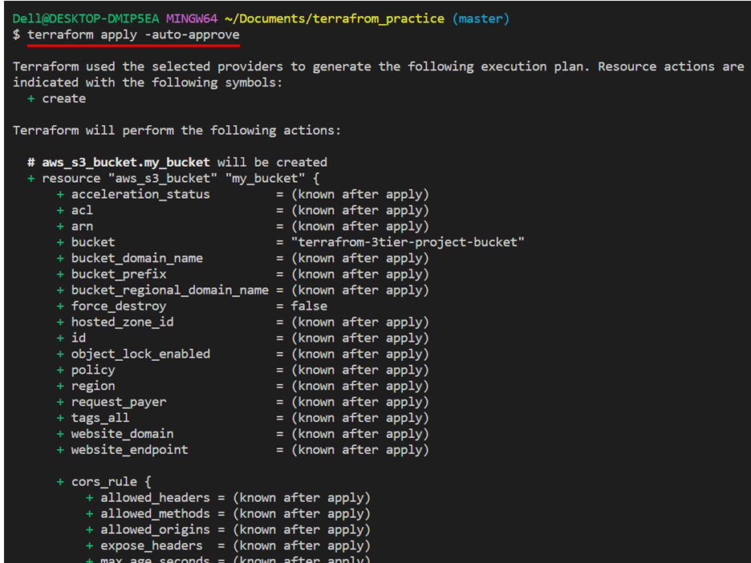

Now if we go to the s3 bucket from the console we can see the bucket got created.

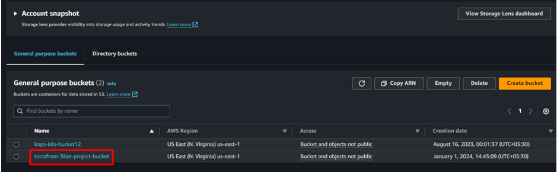


#### Next we need to set up IAM role for ec2
- IAM EC2 Instance Role Creation

Create another file named IAM role in the same folder and follow the below steps;

```
# add the below content inside this file

resource "aws_iam_role" "ec2_instance_role" {
  name = "ec2_instance_role"

  assume_role_policy = jsonencode({
    Version = "2012-10-17",
    Statement = [
      {
        Action = "sts:AssumeRole",
        Effect = "Allow",
        Principal = {
          Service = "ec2.amazonaws.com",
        },
      },
    ],
  })
}

resource "aws_iam_role_policy_attachment" "ec2_ssm_policy" {
  policy_arn = "arn:aws:iam::aws:policy/AmazonSSMManagedInstanceCore"
  role       = aws_iam_role.ec2_instance_role.name
}

resource "aws_iam_role_policy_attachment" "ec2_s3_policy" {
  policy_arn = "arn:aws:iam::aws:policy/AmazonS3ReadOnlyAccess"
  role       = aws_iam_role.ec2_instance_role.name
}
```

Here we are creating an IAM role with 2 permissions. One is for Session manager permission and other is for  s3 read only access for ec2 instances

```
# save the file and execute the below command

terraform vaidate
terraform fmt
terraform plan
terraform apply -auto-approve
```

## Step 2

### Networking and Security

In this we will be building out the VPC networking components as well as security groups that will add a layer of protection around our EC2 instances, Aurora databases, and Elastic Load Balancers.

- First we can	ceate VPC and Subnets.

- create new file called vpc.tf and add below resource to create vpc and subnets

```
resource "aws_vpc" "my_vpc" {
  cidr_block           = "10.0.0.0/16"
  enable_dns_support   = true
  enable_dns_hostnames = true

  tags = {
    Name = "my-vpc"
  }
}

resource "aws_subnet" "public_subnet_az1" {
  vpc_id                  = aws_vpc.my_vpc.id
  cidr_block              = "10.0.1.0/24"
  availability_zone       = "us-east-1a"
  map_public_ip_on_launch = true

  tags = {
    Name = "public-subnet-az1"
  }
}

resource "aws_subnet" "public_subnet_az2" {
  vpc_id                  = aws_vpc.my_vpc.id
  cidr_block              = "10.0.2.0/24"
  availability_zone       = "us-east-1b"
  map_public_ip_on_launch = true

  tags = {
    Name = "public-subnet-az2"
  }
}

resource "aws_subnet" "private_subnet_az1" {
  vpc_id            = aws_vpc.my_vpc.id
  cidr_block        = "10.0.3.0/24"
  availability_zone = "us-east-1a"

  tags = {
    Name = "private-subnet-az1"
  }
}

resource "aws_subnet" "private_subnet_az2" {
  vpc_id            = aws_vpc.my_vpc.id
  cidr_block        = "10.0.4.0/24"
  availability_zone = "us-east-1b"

  tags = {
    Name = "private-subnet-az2"
  }
}

resource "aws_subnet" "private_db_subnet_az1" {
  vpc_id            = aws_vpc.my_vpc.id
  cidr_block        = "10.0.5.0/24"
  availability_zone = "us-east-1a"

  tags = {
    Name = "private-db-subnet-az1"
  }
}

resource "aws_subnet" "private_db_subnet_az2" {
  vpc_id            = aws_vpc.my_vpc.id
  cidr_block        = "10.0.6.0/24"
  availability_zone = "us-east-1b"

  tags = {
    Name = "private-db-subnet-az2"
  }
}

```


```
# save the file and execute the below command

terraform vaidate
terraform fmt
terraform plan
terraform apply -auto-approve
```

- Go to VPC from console and we can see the VPC and subnets has been created

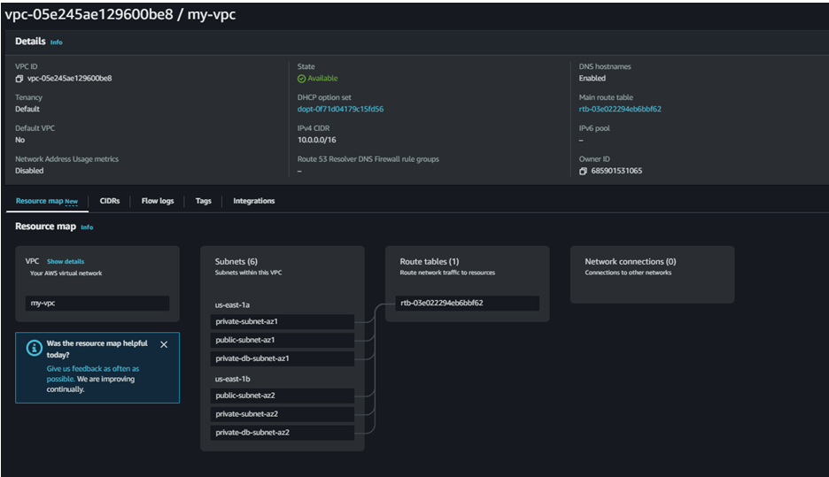

In order to give the public subnets in our VPC internet access we will have to create and attach an Internet Gateway.

To do that we need add the below resource in the same file

```
# add this resource to create and attach igw to the vpc
resource "aws_internet_gateway" "my_igw" {
  vpc_id = aws_vpc.my_vpc.id

  tags = {
    Name = "my-igw"
  }
}
```

```
# save the file and execute the below command

terraform vaidate
terraform fmt
terraform plan
terraform apply -auto-approve
```

Go console and refresh the VPC and we can see the internet gateway created and attached to the vpc

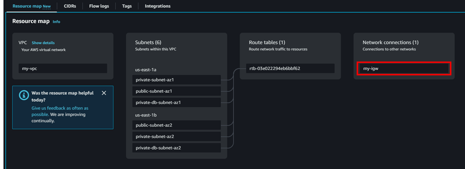


In order for our instances in the app layer private subnet to be able to access the internet they will need to go through a NAT Gateway. For high availability, we’ll deploy one NAT gateway in each public subnet.

Let's create this adding resources inthe same file

```
# add the below resources inthe vpc.tf file
resource "aws_nat_gateway" "nat_gateway_az1" {
  allocation_id = aws_eip.nat_eip_az1.id
  subnet_id     = aws_subnet.public_subnet_az1.id

  tags = {
    Name = "nat-gateway-az1"
  }
}

resource "aws_nat_gateway" "nat_gateway_az2" {
  allocation_id = aws_eip.nat_eip_az2.id
  subnet_id     = aws_subnet.public_subnet_az2.id

  tags = {
    Name = "nat-gateway-az2"
  }
}

resource "aws_eip" "nat_eip_az1" {
}

resource "aws_eip" "nat_eip_az2" {
}
```

```
# save the file and execute the below command

terraform vaidate
terraform fmt
terraform plan
terraform apply -auto-approve
```

If we refresh the vpc console we can see NAT gateway also created


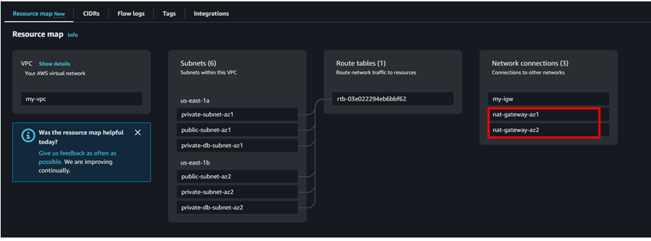


Next, we need to create route table for 2 public subnets and add internet gateway to that.

```
# add the below resources in the same file after igw resource section

resource "aws_route_table" "public_subnet_route_table_az1" {
  vpc_id = aws_vpc.my_vpc.id

  route {
    cidr_block = "0.0.0.0/0"
    gateway_id = aws_internet_gateway.my_igw.id
  }

  tags = {
    Name = "public-subnet-route-table-az1"
  }
}

resource "aws_route_table" "public_subnet_route_table_az2" {
  vpc_id = aws_vpc.my_vpc.id

  route {
    cidr_block = "0.0.0.0/0"
    gateway_id = aws_internet_gateway.my_igw.id
  }

  tags = {
    Name = "public-subnet-route-table-az2"
  }
}
```

```
# save the file and execute the below command

terraform vaidate
terraform fmt
terraform plan
terraform apply -auto-approve
```

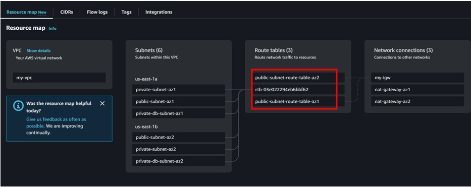

We can see the public route table has been created but we haven’t added the public subnet to this. Let’s do that now;

```
# add the below resources in the same file at last

resource "aws_route_table_association" "public_subnet_association_az1" {
  subnet_id      = aws_subnet.public_subnet_az1.id
  route_table_id = aws_route_table.public_subnet_route_table_az1.id
}

resource "aws_route_table_association" "public_subnet_association_az2" {
  subnet_id      = aws_subnet.public_subnet_az2.id
  route_table_id = aws_route_table.public_subnet_route_table_az2.id
}
```

```
# save the file and execute the below command

terraform vaidate
terraform fmt
terraform plan
terraform apply -auto-approve
```

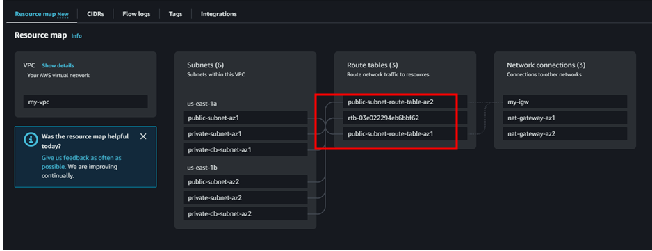

And now we can see the public subnets added to the public route table.


Next let’s do the same for private subnets also.

```
# 	Add these resources to create private route table and associate the private subnets to private route table and execute the terraform commands

resource "aws_route_table" "private_subnet_route_table_az1" {
  vpc_id = aws_vpc.my_vpc.id

  tags = {
    Name = "private-subnet-route-table-az1"
  }
}

resource "aws_route_table" "private_subnet_route_table_az2" {
  vpc_id = aws_vpc.my_vpc.id

  tags = {
    Name = "private-subnet-route-table-az2"
  }
}

resource "aws_route" "private_subnet_route_az1" {
  route_table_id         = aws_route_table.private_subnet_route_table_az1.id
  destination_cidr_block = "0.0.0.0/0"
  nat_gateway_id         = aws_nat_gateway.nat_gateway_az1.id
}

resource "aws_route" "private_subnet_route_az2" {
  route_table_id         = aws_route_table.private_subnet_route_table_az2.id
  destination_cidr_block = "0.0.0.0/0"
  nat_gateway_id         = aws_nat_gateway.nat_gateway_az2.id
}

resource "aws_route_table_association" "private_subnet_association_az1" {
  subnet_id      = aws_subnet.private_subnet_az1.id
  route_table_id = aws_route_table.private_subnet_route_table_az1.id
}

resource "aws_route_table_association" "private_subnet_association_az2" {
  subnet_id      = aws_subnet.private_subnet_az2.id
  route_table_id = aws_route_table.private_subnet_route_table_az2.id
}

```

```
# save the file and execute the below command

terraform vaidate
terraform fmt
terraform plan
terraform apply -auto-approve
```

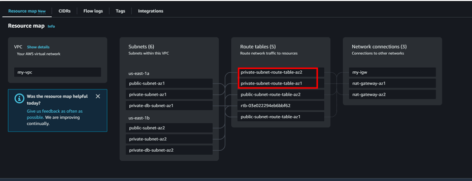

And we can see the private route table has been created associated with private subnets

#### Next step is to create security groups

Security groups will tighten the rules around which traffic will be allowed to our Elastic Load Balancers and EC2 instances.
The first security group we’ll create is for the public, internet facing load balancer. We need to add inbound rule to allow HTTP type traffic for your IP.
Create a new file in the same folder named security_group.tf and add the below resource

```
resource "aws_security_group" "internet_facing_lb_sg" {
  name        = "internet_facing-security-group"
  description = "External load balancer sg"
  vpc_id      = aws_vpc.my_vpc.id
  tags = {
    Name = "internet_facing_lb-sg"
  }
}

resource "aws_security_group_rule" "internet_facing_lb_ingress" {
  security_group_id = aws_security_group.internet_facing_lb_sg.id
  type              = "ingress"
  from_port         = 80
  to_port           = 80
  protocol          = "tcp"
  cidr_blocks       = ["yourIP/32"]
}
```

```
# save the file and execute the below command

terraform vaidate
terraform fmt
terraform plan
terraform apply -auto-approve
```

 - Go to security group from the console and we can see the sg has been created.

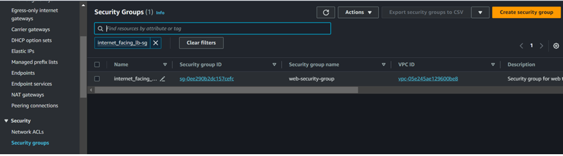


- Next, we need to create second security group for the public instances in the web tier


