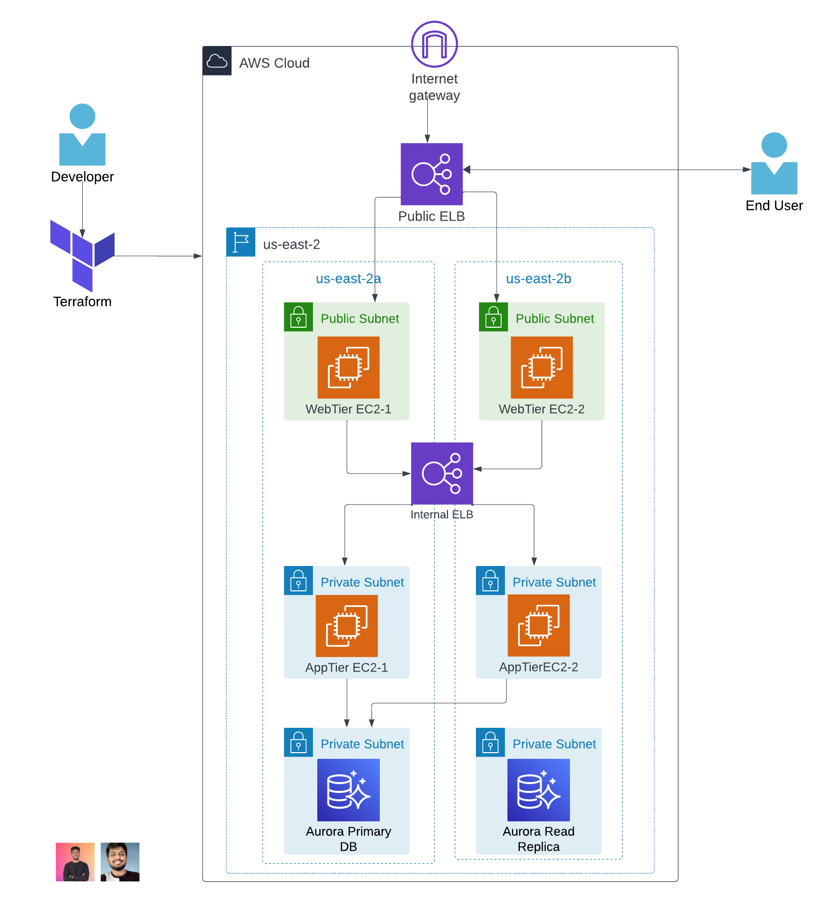

# AWS-Three-Tier-App-Terraform
3 Tier App Deploy to AWS using Terraform

### Architectural Diagram


## Step 1

### Set UP


-	Download Code from Github or using the below URLon your local

```
git clone https://github.com/aws-samples/aws-three-tier-web-architecture-workshop.git
```

- S3 bucket creation using terraform
 
Before creating the s3 bucket using terraform we need to set up the terraform lab. I have written a blog to set up terraform lab. To see that click the link below;
https://medium.com/@fawazcp/create-ec2-instance-using-terraform-71776acf16e3

Once the lab is ready then create a new folder for this project and create new file called s3_bucket.tf then add the below resource. (make sure the s3 bucket name should be unique)

```
provider "aws" {
  region = "us-east-1"
}

resource "aws_s3_bucket" "my_bucket" {
  bucket = "terrafrom-3tier-project-bucket"
}
```

Open any terminal and execute the below terraform commnads


