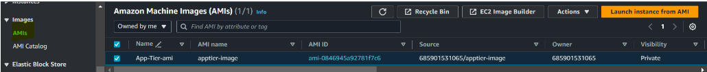

# AWS-Three-Tier-App-Terraform
3 Tier App Deploy to AWS using Terraform

### Architectural Diagram


## Step 1

### Set UP


-	Download Code from Github or using the below URLon your local

```
git clone https://github.com/aws-samples/aws-three-tier-web-architecture-workshop.git
```

- S3 bucket creation using terraform
 
Before creating the s3 bucket using terraform we need to set up the terraform lab. I have written a blog to set up terraform lab. To see that click the link below;
https://medium.com/@fawazcp/create-ec2-instance-using-terraform-71776acf16e3

Once the lab is ready then create a new folder for this project and create new file called s3_bucket.tf then add the below resource. (make sure the s3 bucket name should be unique)

```
provider "aws" {
  region = "us-east-1"
}

resource "aws_s3_bucket" "my_bucket" {
  bucket = "terrafrom-3tier-project-bucket"
}
```

Open any terminal and execute the below terraform commands


Now if we go to the s3 bucket from the console we can see the bucket got created.


#### Next we need to set up IAM role for ec2
- IAM EC2 Instance Role Creation

Create another file named IAM role in the same folder and follow the below steps;

```
# add the below content inside this file

resource "aws_iam_role" "iamrole" {
  name               = "iam-role-3-tier-app"
  path               = "/"
  assume_role_policy = data.aws_iam_policy_document.assume_role.json
  tags = {
    Name        = "3TierApp"
    Environment = "dev"
  }
}

data "aws_iam_policy_document" "assume_role" {
  statement {
    effect = "Allow"

    principals {
      type        = "Service"
      identifiers = ["ec2.amazonaws.com"]
    }

    actions = ["sts:AssumeRole"]
  }
}

resource "aws_iam_role_policy_attachment" "attach_policy1" {
  policy_arn = "arn:aws:iam::aws:policy/AmazonSSMManagedInstanceCore"
  role       = aws_iam_role.iamrole.name
  depends_on = [aws_iam_role.iamrole]
}

resource "aws_iam_role_policy_attachment" "attach_policy2" {
  policy_arn = "arn:aws:iam::aws:policy/AmazonS3ReadOnlyAccess"
  role       = aws_iam_role.iamrole.name
  depends_on = [aws_iam_role.iamrole]
}

resource "aws_iam_instance_profile" "ec2-profile" {
  name       = "three-tier-ec2-profile"
  role       = aws_iam_role.iamrole.name
  depends_on = [aws_iam_role.iamrole]
}
```

Here we are creating an IAM role with 2 permissions. One is for Session manager permission and other is for  s3 read only access for ec2 instances

```
# save the file and execute the below command

terraform vaidate
terraform fmt
terraform plan
terraform apply -auto-approve
```

## Step 2

### Networking and Security

In this we will be building out the VPC networking components as well as security groups that will add a layer of protection around our EC2 instances, Aurora databases, and Elastic Load Balancers.

- First we can	ceate VPC and Subnets.

- create new file called vpc.tf and add below resource to create vpc and subnets

```
resource "aws_vpc" "my_vpc" {
  cidr_block           = "10.0.0.0/16"
  enable_dns_support   = true
  enable_dns_hostnames = true

  tags = {
    Name = "my-vpc"
  }
}

resource "aws_subnet" "public_subnet_az1" {
  vpc_id                  = aws_vpc.my_vpc.id
  cidr_block              = "10.0.1.0/24"
  availability_zone       = "us-east-1a"
  map_public_ip_on_launch = true

  tags = {
    Name = "public-subnet-az1"
  }
}

resource "aws_subnet" "public_subnet_az2" {
  vpc_id                  = aws_vpc.my_vpc.id
  cidr_block              = "10.0.2.0/24"
  availability_zone       = "us-east-1b"
  map_public_ip_on_launch = true

  tags = {
    Name = "public-subnet-az2"
  }
}

resource "aws_subnet" "private_subnet_az1" {
  vpc_id            = aws_vpc.my_vpc.id
  cidr_block        = "10.0.3.0/24"
  availability_zone = "us-east-1a"

  tags = {
    Name = "private-subnet-az1"
  }
}

resource "aws_subnet" "private_subnet_az2" {
  vpc_id            = aws_vpc.my_vpc.id
  cidr_block        = "10.0.4.0/24"
  availability_zone = "us-east-1b"

  tags = {
    Name = "private-subnet-az2"
  }
}

resource "aws_subnet" "private_db_subnet_az1" {
  vpc_id            = aws_vpc.my_vpc.id
  cidr_block        = "10.0.5.0/24"
  availability_zone = "us-east-1a"

  tags = {
    Name = "private-db-subnet-az1"
  }
}

resource "aws_subnet" "private_db_subnet_az2" {
  vpc_id            = aws_vpc.my_vpc.id
  cidr_block        = "10.0.6.0/24"
  availability_zone = "us-east-1b"

  tags = {
    Name = "private-db-subnet-az2"
  }
}

```


```
# save the file and execute the below command

terraform vaidate
terraform fmt
terraform plan
terraform apply -auto-approve
```

- Go to VPC from console and we can see the VPC and subnets has been created


In order to give the public subnets in our VPC internet access we will have to create and attach an Internet Gateway.

To do that we need add the below resource in the same file

```
# add this resource to create and attach igw to the vpc
resource "aws_internet_gateway" "my_igw" {
  vpc_id = aws_vpc.my_vpc.id

  tags = {
    Name = "my-igw"
  }
}
```

```
# save the file and execute the below command

terraform vaidate
terraform fmt
terraform plan
terraform apply -auto-approve
```

Go console and refresh the VPC and we can see the internet gateway created and attached to the vpc


In order for our instances in the app layer private subnet to be able to access the internet they will need to go through a NAT Gateway. For high availability, we’ll deploy one NAT gateway in each public subnet.

Let's create this adding resources inthe same file

```
# add the below resources inthe vpc.tf file
resource "aws_nat_gateway" "nat_gateway_az1" {
  allocation_id = aws_eip.nat_eip_az1.id
  subnet_id     = aws_subnet.public_subnet_az1.id

  tags = {
    Name = "nat-gateway-az1"
  }
}

resource "aws_nat_gateway" "nat_gateway_az2" {
  allocation_id = aws_eip.nat_eip_az2.id
  subnet_id     = aws_subnet.public_subnet_az2.id

  tags = {
    Name = "nat-gateway-az2"
  }
}

resource "aws_eip" "nat_eip_az1" {
}

resource "aws_eip" "nat_eip_az2" {
}
```

```
# save the file and execute the below command

terraform vaidate
terraform fmt
terraform plan
terraform apply -auto-approve
```

If we refresh the vpc console we can see NAT gateway also created


Next, we need to create route table for 2 public subnets and add internet gateway to that.

```
# add the below resources in the same file after igw resource section

resource "aws_route_table" "public_subnet_route_table_az1" {
  vpc_id = aws_vpc.my_vpc.id

  route {
    cidr_block = "0.0.0.0/0"
    gateway_id = aws_internet_gateway.my_igw.id
  }

  tags = {
    Name = "public-subnet-route-table-az1"
  }
}

resource "aws_route_table" "public_subnet_route_table_az2" {
  vpc_id = aws_vpc.my_vpc.id

  route {
    cidr_block = "0.0.0.0/0"
    gateway_id = aws_internet_gateway.my_igw.id
  }

  tags = {
    Name = "public-subnet-route-table-az2"
  }
}
```

```
# save the file and execute the below command

terraform vaidate
terraform fmt
terraform plan
terraform apply -auto-approve
```


We can see the public route table has been created but we haven’t added the public subnet to this. Let’s do that now;

```
# add the below resources in the same file at last

resource "aws_route_table_association" "public_subnet_association_az1" {
  subnet_id      = aws_subnet.public_subnet_az1.id
  route_table_id = aws_route_table.public_subnet_route_table_az1.id
}

resource "aws_route_table_association" "public_subnet_association_az2" {
  subnet_id      = aws_subnet.public_subnet_az2.id
  route_table_id = aws_route_table.public_subnet_route_table_az2.id
}
```

```
# save the file and execute the below command

terraform vaidate
terraform fmt
terraform plan
terraform apply -auto-approve
```


And now we can see the public subnets added to the public route table.


Next let’s do the same for private subnets also.

```
# 	Add these resources to create private route table and associate the private subnets to private route table and execute the terraform commands

resource "aws_route_table" "private_subnet_route_table_az1" {
  vpc_id = aws_vpc.my_vpc.id

  tags = {
    Name = "private-subnet-route-table-az1"
  }
}

resource "aws_route_table" "private_subnet_route_table_az2" {
  vpc_id = aws_vpc.my_vpc.id

  tags = {
    Name = "private-subnet-route-table-az2"
  }
}

resource "aws_route" "private_subnet_route_az1" {
  route_table_id         = aws_route_table.private_subnet_route_table_az1.id
  destination_cidr_block = "0.0.0.0/0"
  nat_gateway_id         = aws_nat_gateway.nat_gateway_az1.id
}

resource "aws_route" "private_subnet_route_az2" {
  route_table_id         = aws_route_table.private_subnet_route_table_az2.id
  destination_cidr_block = "0.0.0.0/0"
  nat_gateway_id         = aws_nat_gateway.nat_gateway_az2.id
}

resource "aws_route_table_association" "private_subnet_association_az1" {
  subnet_id      = aws_subnet.private_subnet_az1.id
  route_table_id = aws_route_table.private_subnet_route_table_az1.id
}

resource "aws_route_table_association" "private_subnet_association_az2" {
  subnet_id      = aws_subnet.private_subnet_az2.id
  route_table_id = aws_route_table.private_subnet_route_table_az2.id
}

```

```
# save the file and execute the below command

terraform vaidate
terraform fmt
terraform plan
terraform apply -auto-approve
```


And we can see the private route table has been created associated with private subnets

#### Next step is to create security groups

Security groups will tighten the rules around which traffic will be allowed to our Elastic Load Balancers and EC2 instances.
The first security group we’ll create is for the public, internet facing load balancer. We need to add inbound rule to allow HTTP type traffic for your IP.
Create a new file in the same folder named security_group.tf and add the below resource

```
resource "aws_security_group" "internet_facing_lb_sg" {
  name        = "internet_facing-security-group"
  description = "External load balancer sg"
  vpc_id      = aws_vpc.my_vpc.id
  tags = {
    Name = "internet_facing_lb-sg"
  }
}

resource "aws_security_group_rule" "internet_facing_lb_ingress" {
  security_group_id = aws_security_group.internet_facing_lb_sg.id
  type              = "ingress"
  from_port         = 80
  to_port           = 80
  protocol          = "tcp"
  cidr_blocks       = ["yourIP/32"]
}
```

```
# save the file and execute the below command

terraform vaidate
terraform fmt
terraform plan
terraform apply -auto-approve
```

 - Go to security group from the console and we can see the sg has been created.


- Next, we need to create second security group for the public instances in the web tier

```
# add the below resouces inthe same file

resource "aws_security_group" "WebTierSG" {
  name        = "webtier-security-group"
  description = "Security group for web tier"
  vpc_id      = aws_vpc.my_vpc.id
  tags = {
    Name = "WebTierSG"
  }
}

resource "aws_security_group_rule" "WebTierSG_ingress" {
  security_group_id = aws_security_group.WebTierSG.id
  type              = "ingress"
  from_port         = 80
  to_port           = 80
  protocol          = "tcp"
  cidr_blocks       = ["your_ip/32"]
}

resource "aws_security_group_rule" "traffic_from_internet_facing-lb-sg" {
  security_group_id        = aws_security_group.WebTierSG.id
  type                     = "ingress"
  from_port                = 80
  to_port                  = 80
  protocol                 = "tcp"
  source_security_group_id = aws_security_group.internet_facing_lb_sg.id
}
```

```
# save the file and execute the below command

terraform vaidate
terraform fmt
terraform plan
terraform apply -auto-approve
```

- Next, we need to create sg for our internal load balancer.

```
# add the below resouces inthe same file

resource "aws_security_group" "internal-lb-sg" {
  name        = "internal-lb-sg"
  description = "Security group for internal lb"
  vpc_id      = aws_vpc.my_vpc.id
  tags = {
    Name = "internal-lb-sg"
  }
}

resource "aws_security_group_rule" "traffic_to_internal_facing-lb-sg" {
  security_group_id        = aws_security_group.internal-lb-sg.id
  type                     = "ingress"
  from_port                = 80
  to_port                  = 80
  protocol                 = "tcp"
  source_security_group_id = aws_security_group.WebTierSG.id
}

```

```
# save the file and execute the below command

terraform vaidate
terraform fmt
terraform plan
terraform apply -auto-approve
```

Next we’ll configure SG for our private instances. After typing a name and description, add an inbound rule that will allow TCP type traffic on port 4000 from the internal load balancer security group you created in the previous step. This is the port our app tier application is running on and allows our internal load balancer to forward traffic on this port to our private instances. You should also add another route for port 4000 that allows your IP for testing. Let’s see how to do that

```
# add the below resouces inthe same file

resource "aws_security_group" "PrivateinstanceSG" {
  name        = "PrivateinstanceSG"
  description = "Security group for private app tier sg"
  vpc_id      = aws_vpc.my_vpc.id
  tags = {
    Name = "PrivateinstanceSG"
  }
}

resource "aws_security_group_rule" "PrivateinstanceSG_ingress" {
  security_group_id = aws_security_group.PrivateinstanceSG.id
  type              = "ingress"
  from_port         = 4000
  to_port           = 4000
  protocol          = "tcp"
  cidr_blocks       = ["your_ip/32"]
}

resource "aws_security_group_rule" "PrivateinstanceSG_rule" {
  security_group_id        = aws_security_group.PrivateinstanceSG.id
  type                     = "ingress"
  from_port                = 4000
  to_port                  = 4000
  protocol                 = "tcp"
  source_security_group_id = aws_security_group.internal-lb-sg.id
}
```

```
# save the file and execute the below command

terraform vaidate
terraform fmt
terraform plan
terraform apply -auto-approve
```


The next security group we’ll configure protects our private database instances. For this security group, add an inbound rule that will allow traffic from the private instance security group to the MYSQL/Aurora port (3306).

```
# add the below resouces inthe same file

resource "aws_security_group" "database-sg" {
  name        = "database-sg"
  description = "Security group for databases"
  vpc_id      = aws_vpc.my_vpc.id
  tags = {
    Name = "database-sg"
  }
}

resource "aws_security_group_rule" "database-sg_rule" {
  security_group_id        = aws_security_group.database-sg.id
  type                     = "ingress"
  from_port                = 3306
  to_port                  = 3306
  protocol                 = "tcp"
  source_security_group_id = aws_security_group.PrivateinstanceSG.id
}
```

```
# save the file and execute the below command

terraform vaidate
terraform fmt
terraform plan
terraform apply -auto-approve
```

- Go to AWS console under security groups must see the below sg


## Step 3

### Database Deployment

In order create database first we need to create subnet groups for database. Let’s see how to create subnet group;

```
# Create a new file named database.tf and add the below resources to create the subnet group

resource "aws_db_subnet_group" "database_subnet_group" {
  name       = "database-subnet-group"
  subnet_ids = [aws_subnet.private_db_subnet_az1.id, aws_subnet.private_db_subnet_az2.id]
  tags = {
    Name        = "Database Subnet Group"
    Environment = "testing"
  }
}
```

```
# save the file and execute the below command

terraform vaidate
terraform fmt
terraform plan
terraform apply -auto-approve
```


If you go to RDS dashboard under subnet groups we can see the subnet group has been created.

Next, we need to create Aurora Mysql RDS with one read replica. To create this we can add the below script in the database.tf file

```
# add the below resources to create the Aurora Mysql RDS

resource "aws_rds_cluster" "cluster" {
  engine             = "aurora-mysql"
  engine_mode        = "provisioned"
  engine_version     = "8.0"
  cluster_identifier = "aurora-database"
  master_username    = "admin"
  master_password    = "admin123"
  database_name      = "my_database"

  db_subnet_group_name   = aws_db_subnet_group.database_subnet_group.name
  vpc_security_group_ids = [aws_security_group.database-sg.id]

  backup_retention_period = 1
  skip_final_snapshot     = true
}

resource "aws_rds_cluster_instance" "cluster_instances" {
  identifier          = "database-1"
  count               = 1
  cluster_identifier  = aws_rds_cluster.cluster.id
  instance_class      = "db.t3.medium"
  engine              = aws_rds_cluster.cluster.engine
  engine_version      = aws_rds_cluster.cluster.engine_version
  publicly_accessible = false
}

resource "aws_rds_cluster_instance" "read_replica_instance" {
  identifier          = "database-read-replica-1"
  count               = 1
  cluster_identifier  = aws_rds_cluster.cluster.id
  instance_class      = "db.t3.medium" # Adjust as needed
  engine              = aws_rds_cluster.cluster.engine
  engine_version      = aws_rds_cluster.cluster.engine_version
  publicly_accessible = false
}
```

```
# save the file and execute the below command

terraform vaidate
terraform fmt
terraform plan
terraform apply -auto-approve
```


- wait for sometime and go RDS dashboard and we can see database has been created

## Step 4

### App Tier Deployment

In this section of our workshop we will create an EC2 instance for our app layer and make all necessary software configurations so that the app can run. The app layer consists of a Node.js application that will run on port 4000. We will also configure our database with some data and tables.

In order create app tier ec2 first follow the below steps;

```
# Create a new file named app_tier.tf and add the below resources

# Define App Tier EC2 instance with IAM instance profile
resource "aws_instance" "app-tier" {
  ami                    = "ami-085648d85db272f29" # Replace with your desired AMI
  instance_type          = "t2.micro"
  subnet_id              = aws_subnet.private-app-az1.id # Specify the private app subnet ID
  iam_instance_profile   = aws_iam_instance_profile.ec2-profile.name
  vpc_security_group_ids = [aws_security_group.PrivateinstanceSG.id] # Reference the security group ID

  user_data = <<-EOF
              #!/bin/bash
              sudo yum install mysql -y
              sudo yum install -y amazon-ssm-agent
              curl -o- https://raw.githubusercontent.com/nvm-sh/nvm/v0.38.0/install.sh | bash
              source ~/.bashrc
              nvm install 16
              nvm use 16
              npm install -g pm2   
              cd ~/
              aws s3 cp s3://s3-bucket-for-3-tier-app/app-tier/ app-tier --recursive
              cd ~/app-tier
              npm install
              pm2 start index.js
              pm2 startup
              pm2 save
            EOF

  tags = {
    Name        = "App-Tier-EC2"
    Environment = "dev"
  }

  depends_on = [aws_iam_instance_profile.ec2-profile]
}
```

```
# save the file and execute the below command

terraform vaidate
terraform fmt
terraform plan
terraform apply -auto-approve
```

If we go the console we can see the intance has been creted.


Next, we need to connect the ec2 instance to configure Database.


```
Connect App Tier EC@ via Session Manager & Run following commands

sudo yum install mysql -y
mysql -h CHANGE-TO-YOUR-RDS-ENDPOINT -u CHANGE-TO-USER-NAME -p
CREATE DATABASE webappdb;   
SHOW DATABASES;
USE webappdb;    

CREATE TABLE IF NOT EXISTS transactions(id INT NOT NULL
AUTO_INCREMENT, amount DECIMAL(10,2), description
VARCHAR(100), PRIMARY KEY(id));    

SHOW TABLES;    

INSERT INTO transactions (amount,description) VALUES ('400','groceries');   

SELECT * FROM transactions;

```

##### Next, we need to configure our app instance

The first thing we will do is update our database credentials for the app tier. To do this, open the **application-code/app-tier/DbConfig.js** file from the github repo in your favorite text editor on your computer. You’ll see empty strings for the **hostname, user, password and database**. Fill this in with the credentials you configured for your database, the writer endpoint of your database as the hostname, and webappdb for the database. Save the file.

```
module.exports = Object.freeze({
    DB_HOST : 'DATABASE_ENDPOINT',
    DB_USER : 'DATABASE_USERNAME',
    DB_PWD : 'DBPASSWORD',
    DB_DATABASE : 'webappdb'
});
```

## Step 5

### Create App Tier & Web Tier AMI

```
# Create a new file named ami.tf and add the below resources

resource "aws_ami_from_instance" "apptier-ami" {
  name               = "apptier-image"
  source_instance_id = aws_instance.app-tier.id
  depends_on         = [aws_instance.app-tier]
    tags = {
    Name        = "App-Tier-ami"
  }
}
```


## Step 6

### Create Internal Load Balancer & Auto Scaling Group

Once AMI has been created, we can go ahead and create our target group to use with the internal load balancer and also we will create an auto scaling group. First, we will create target group, to do that create new file named internal_lb_tg_asg.tf and follow the below steps;

```
# Create a new file named internal_lb_tg_asg.tf and add the below resources

# AWS LB Target Group for Internal LB
resource "aws_lb_target_group" "internal-lb-tg" {
  name     = "internal-lb-tg"
  port     = 4000
  protocol = "HTTP"
  vpc_id   = aws_vpc.aws-vpc.id

  health_check {
    path = "/health"
  }
  depends_on = [aws_vpc.aws-vpc]
}
```

```
# save the file and execute the below command

terraform vaidate
terraform fmt
terraform plan
terraform apply -auto-approve
```
- Once the script has been executed go to the target group from the console and we can see the target group has been created.


Next, we can create the load balancer. To do the add the below resources in the same file

```
# AWS Load Balancer
resource "aws_lb" "internal-lb" {
  name               = "app-tier-internal-lb"
  internal           = true
  load_balancer_type = "application"
  security_groups    = [aws_security_group.internal-lb-sg.id]
  subnets            = [aws_subnet.private-app-az1.id, aws_subnet.private-app-az2.id]

  tags = {
    Environment = "dev"
  }

}

resource "aws_lb_listener" "internal-lb-tg-listener" {
  load_balancer_arn = aws_lb.internal-lb.arn
  port              = 80
  protocol          = "HTTP"

  default_action {
    type             = "forward"
    target_group_arn = aws_lb_target_group.internal-lb-tg.arn
  }
}
```
```
# save the file and execute the below command

terraform vaidate
terraform fmt
terraform plan
terraform apply -auto-approve
```
And if we go to the console we can see the load balancer created


Next, we need to create a Launch template with the AMI we created earlier. 
- To create launch template add the below resource in the same file

```
# App Tier Launch Template
resource "aws_launch_template" "app-tier-launch-template" {
  name                   = "app-tier-launch-template"
  description            = "App Tier Launch Template Description"
  instance_type          = "t2.micro"
  vpc_security_group_ids = [aws_security_group.PrivateinstanceSG.id]
  image_id               = aws_ami_from_instance.apptier-ami.id

  iam_instance_profile {
    name = aws_iam_instance_profile.ec2-profile.name
  }

  depends_on = [
    aws_iam_instance_profile.ec2-profile,
    aws_security_group.PrivateinstanceSG,
  ]

}
```

```
# save the file and execute the below command

terraform vaidate
terraform fmt
terraform plan
terraform apply -auto-approve
```
Now if we go to Launch template from the console we can see one launch template has been created


We will now create the Auto Scaling Group for our app instances. To do that create a new file called asg.tf and follow the below steps;

```
# App Tier Auto Scaling Group
resource "aws_autoscaling_group" "app-tier-auto-scalling-group" {
  name                      = "App-Tier-ASG"
  max_size                  = 2
  min_size                  = 2
  health_check_grace_period = 300
  health_check_type         = "ELB"
  desired_capacity          = 2
  force_delete              = true
  vpc_zone_identifier       = [aws_subnet.private-app-az1.id, aws_subnet.private-app-az2.id]
  #   load_balancers            = [aws_lb.internal-lb.id]
  target_group_arns = [aws_lb_target_group.internal-lb-tg.arn]

  launch_template {
    id      = aws_launch_template.app-tier-launch-template.id
    version = "$Latest"
  }
}

```

```
# save the file and execute the below command

terraform vaidate
terraform fmt
terraform plan
terraform apply -auto-approve
```

Go to the console and we can see Autoscaling Group is created


## Step 7

### Web Tier Deployment

In this section we will deploy an EC2 instance for the web tier and make all necessary software configurations for the NGINX web server and React.js website

```
# Create a new file named web_tier.tf and add the below resources

# Define Web Tier EC2 instance with IAM instance profile
resource "aws_instance" "web-tier" {
  ami                    = "ami-085648d85db272f29" # Replace with your desired AMI
  instance_type          = "t2.micro"
  subnet_id              = aws_subnet.public-web-az1.id # Specify the private app subnet ID
  iam_instance_profile   = aws_iam_instance_profile.ec2-profile.name
  vpc_security_group_ids = [aws_security_group.WebTierSG.id] # Reference the security group ID
  associate_public_ip_address = true
  key_name               = "YOUR_KEY_NAME"

  user_data = <<-EOF
              #!/bin/bash
              curl -o- https://raw.githubusercontent.com/nvm-sh/nvm/v0.38.0/install.sh | bash
              source ~/.bashrc
              nvm install 16
              nvm use 16
              cd ~/
              aws s3 cp s3://s3-bucket-for-3-tier-app/web-tier/ web-tier --recursive
              cd ~/web-tier
              npm install 
              npm run build
              sudo amazon-linux-extras install nginx1 -y
              cd /etc/nginx
              ls
              sudo rm nginx.conf
              sudo aws s3 cp s3://s3-bucket-for-3-tier-app/nginx.conf .
              sudo service nginx restart
              chmod -R 755 /home/ec2-user
              sudo chkconfig nginx on
            EOF

  tags = {
    Name        = "Web-Tier-EC2"
    Environment = "dev"
  }

  depends_on = [aws_iam_instance_profile.ec2-profile]
}

```

```
# save the file and execute the below command

terraform vaidate
terraform fmt
terraform plan
terraform apply -auto-approve
```

- Go to ec2 console and we can see the web-tier instance has been created.


# continue from here

## Step 8

### External Load Balancer & Auto Scaling Group

```
# Create a new file named external_lb_tg_asg.tf and add the below resources

# AWS LB Target Group for External LB
resource "aws_lb_target_group" "external-lb-tg" {
  name     = "external-lb-tg"
  port     = 80
  protocol = "HTTP"
  vpc_id   = aws_vpc.aws-vpc.id

  health_check {
    path = "/health"
  }
  depends_on = [aws_vpc.aws-vpc]
}

# AWS Load Balancer
resource "aws_lb" "external-lb" {
  name               = "web-tier-external-lb"
  internal           = false
  load_balancer_type = "application"
  security_groups    = [aws_security_group.internet_facing_lb_sg.id]
  subnets            = [aws_subnet.public-web-az1.id, aws_subnet.public-web-az2.id]

  tags = {
    Environment = "dev"
  }

}

resource "aws_lb_listener" "external-lb-tg-listener" {
  load_balancer_arn = aws_lb.external-lb.arn
  port              = 80
  protocol          = "HTTP"

  default_action {
    type             = "forward"
    target_group_arn = aws_lb_target_group.external-lb-tg.arn
  }
}

# Web Tier Launch Template
resource "aws_launch_template" "web-tier-launch-template" {
  name                   = "web-tier-launch-template"
  description            = "Web Tier Launch Template Description"
  instance_type          = "t2.micro"
  vpc_security_group_ids = [aws_security_group.WebTierSG.id]
  image_id               = aws_ami_from_instance.webtier-ami.id

  iam_instance_profile {
    name = aws_iam_instance_profile.ec2-profile.name
  }

  depends_on = [
    aws_iam_instance_profile.ec2-profile,
    aws_security_group.WebTierSG,
  ]

}

# Web Tier Auto Scaling Group
resource "aws_autoscaling_group" "web-tier-auto-scalling-group" {
  name                      = "Web-Tier-ASG"
  max_size                  = 2
  min_size                  = 2
  health_check_grace_period = 300
  health_check_type         = "ELB"
  desired_capacity          = 2
  force_delete              = true
  vpc_zone_identifier       = [aws_subnet.public-web-az1.id, aws_subnet.public-web-az2.id]
    # load_balancers            = [aws_lb.external-lb.id]
  target_group_arns = [aws_lb_target_group.external-lb-tg.arn]

  launch_template {
    id      = aws_launch_template.web-tier-launch-template.id
    version = "$Latest"
  }
}

```

Infrastructure Deployment

    alias tf="terraform"
    tf init
    tf fmt
    tf validate
    tf plan
    tf apply --auto-approve
    tf destroy --auto-approve

Thank You! :shipit:
